# Data Analytics & Visualization Exam


#

### **Soal 1 - MySQL Database**

Tuliskan langkah-langkah/urutan query MySQL untuk membuat sebuah database **"sekolahku"** yang memiliki beberapa tabel: __"users"__, **"courses"** dan __"userCourse"__, dengan ketentuan di bawah ini:

1. Buatlah tabel **"users"** yang memiliki struktur/model sebagai berikut. Tabel __"users"__ merupakan kumpulan data peserta didik di sebuah sekolah.

    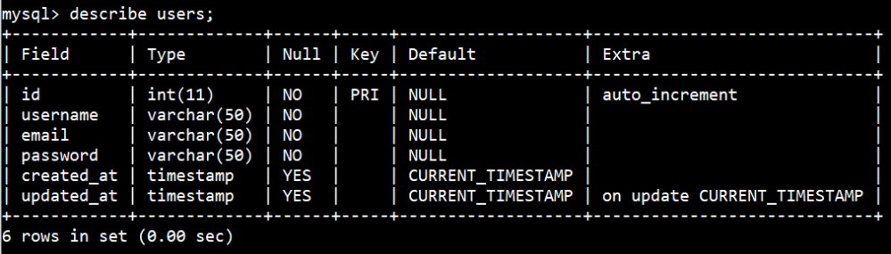

    Masukkan beberapa data berikut ke dalam tabel __"users"__. Hasil yang diharapkan adalah:

    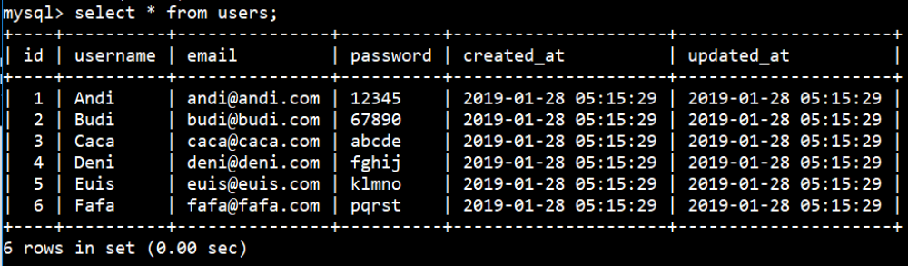

2. Buatlah tabel **"courses"** yang memiliki struktur/model sebagai berikut. Tabel __"courses"__ merupakan kumpulan data mata kuliah yang diajarkan di sebuah sekolah.

    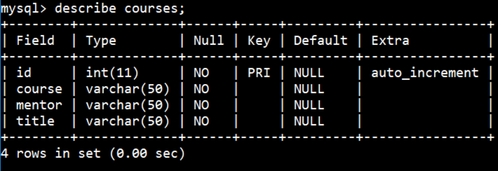

    Masukkan beberapa data berikut ke dalam tabel __"courses"__. Hasil yang diharapkan adalah:

    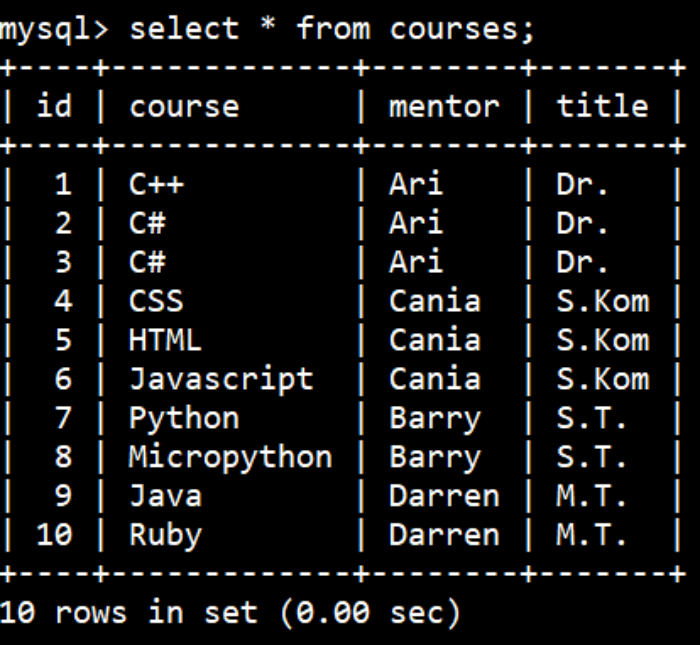

3. Buatlah tabel **"userCourse"** yang memiliki struktur/model sebagai berikut. Tabel __"userCourse"__ merupakan tabel penghubung/transaksi antara tabel __"user"__ & __"courses"__.

    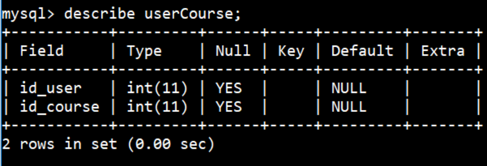

    Masukkan beberapa data berikut ke dalam tabel __"userCourse"__. Hasil yang diharapkan adalah:

    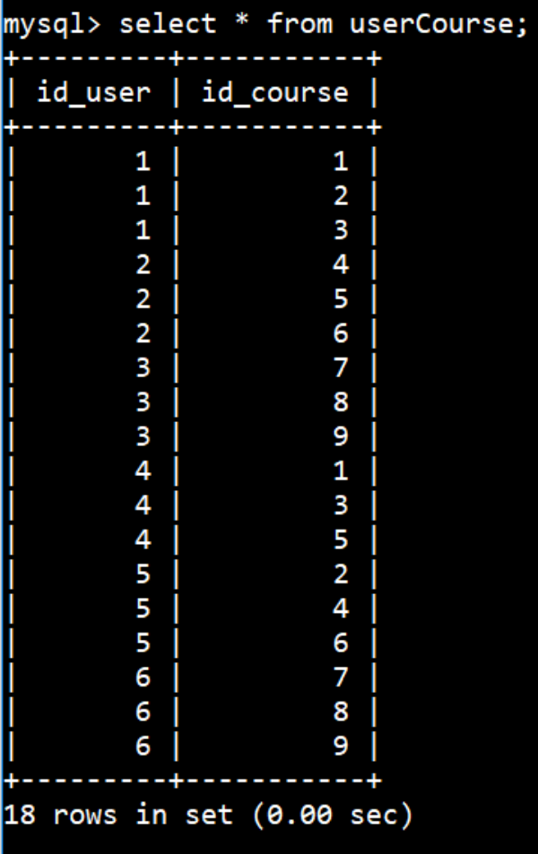

4. Dari tabel __"users"__, **"courses"** dan __"userCourse"__, tampilkan semua daftar peserta didik beserta mata kuliah yang diikutinya, lengkap dengan nama & gelar mentornya. Hasil yang diharapkan adalah sebagai berikut:

    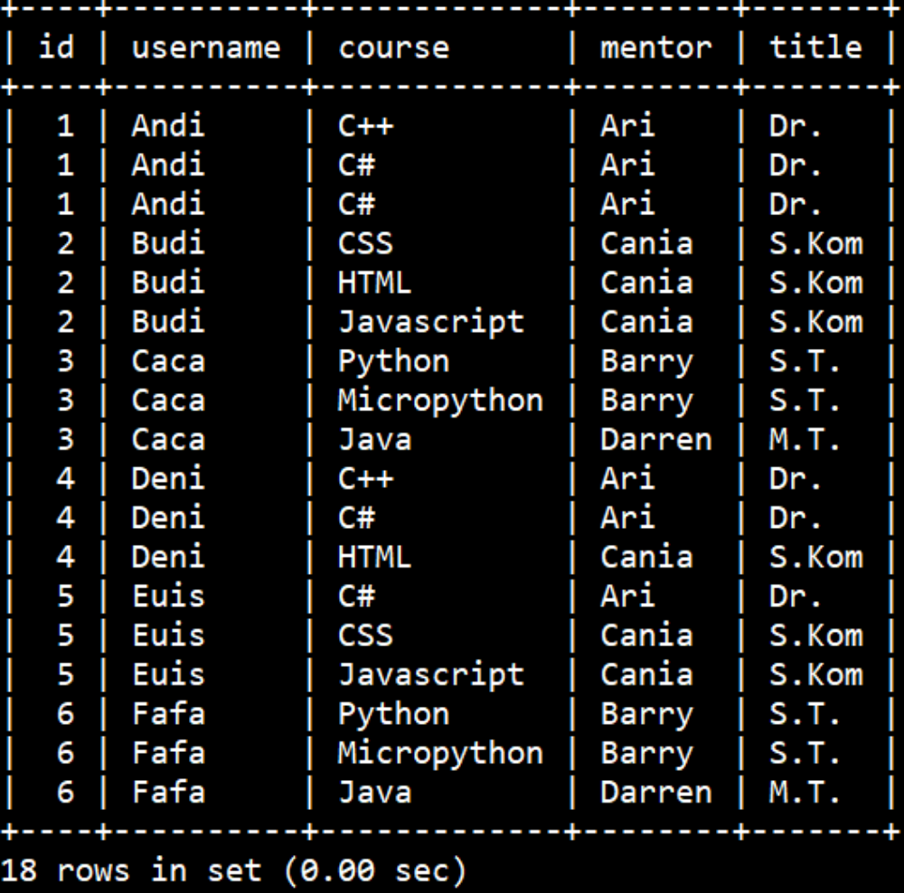

5. Dari tabel __"users"__, **"courses"** dan __"userCourse"__, tampilkan daftar peserta didik beserta mata kuliah yang diikutinya, __yang mentornya bergelar sarjana__. Hasil yang diharapkan adalah sebagai berikut:

    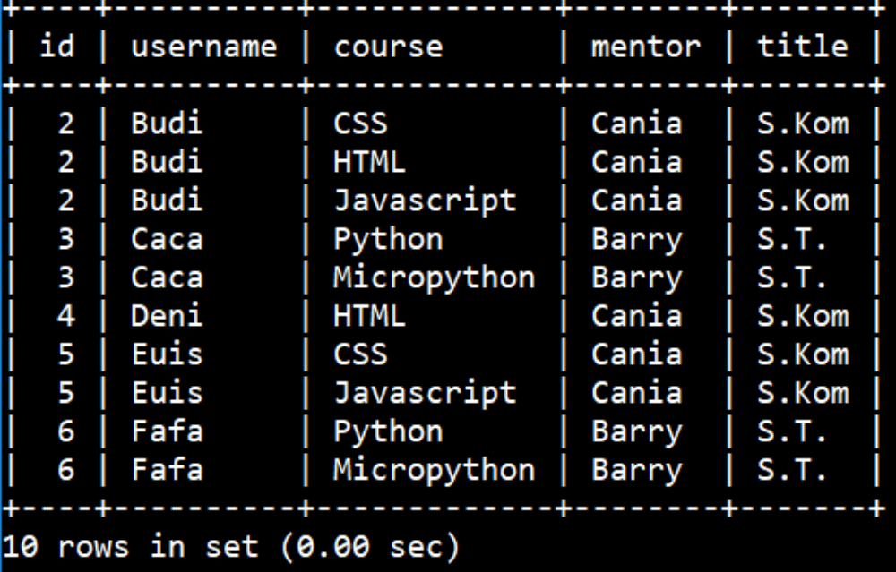

6. Dari tabel __"users"__, **"courses"** dan __"userCourse"__, tampilkan daftar peserta didik beserta mata kuliah yang diikutinya, __yang mentornya bergelar selain sarjana__. Hasil yang diharapkan adalah sebagai berikut:

    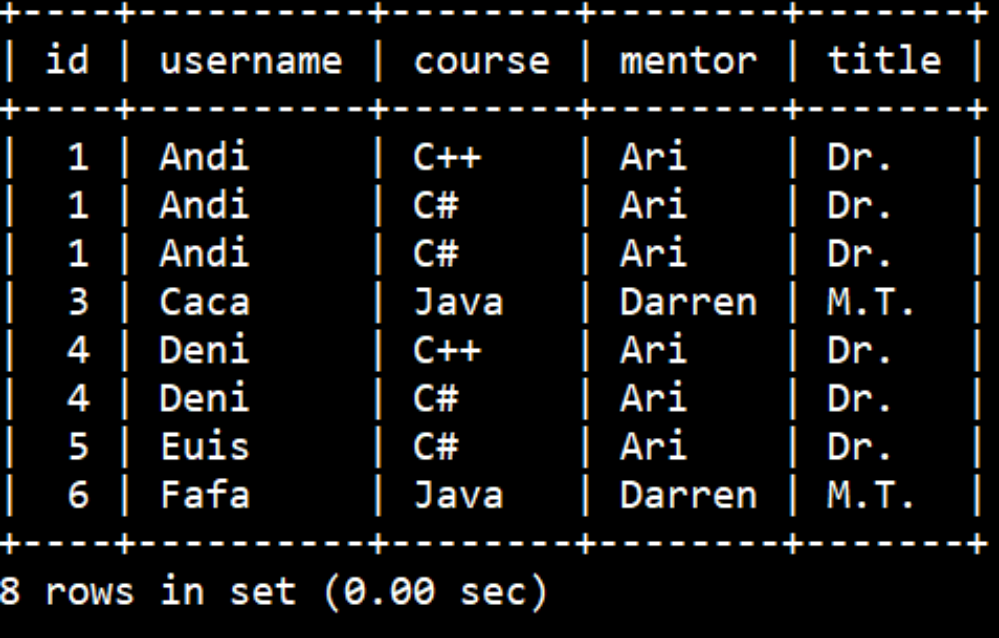

7. Dari tabel __"users"__, **"courses"** dan __"userCourse"__, tampilkan __jumlah peserta didik__ untuk setiap mata kuliah. Hasil yang diharapkan adalah sebagai berikut:

    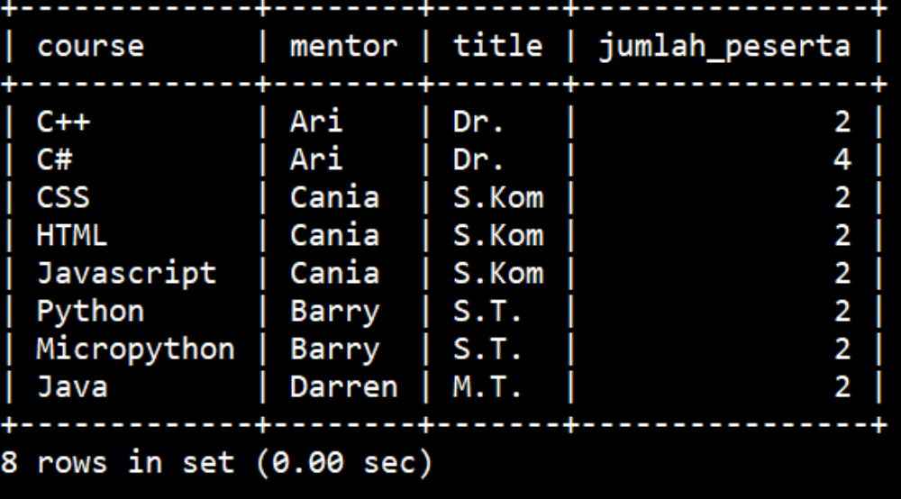

8. Dari tabel __"users"__, **"courses"** dan __"userCourse"__, tampilkan __jumlah peserta didik__ beserta __total fee__ untuk setiap mentor. Total fee dihitung dengan besaran Rp 2.000.000,- per peserta didik. Hasil yang diharapkan adalah sebagai berikut:

    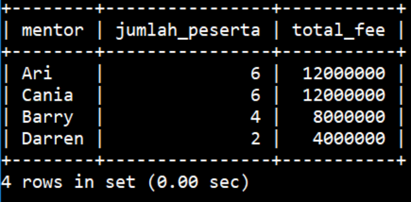

_**Catatan:**_ _Soal ini hanya meminta Anda untuk menuliskan langkah-langkah/urutan query MySQL sesuai spesifikasi di atas. Ketik jawaban dalam sebuah file __.txt__ & lampirkan via email ke lintang@purwadhika.com!_

#

### **Soal 2 - SPLTV (Sistem Persamaan Linear Tiga Variabel)**

Bersumber dari [blog catarinadyah90](https://catarinadyah90.wordpress.com/2014/04/28/sistem-persamaan-linear-tiga-variabel-spltv/), terdapat 3 buah persamaan linear 3 variabel sebagai berikut:

```bash
x  - 2y +  z =  6
3x +  y - 2z =  4
7x - 6y -  z = 10
```

1. Dengan menggunakan __numpy__, buatlah sebuah program __python__ yang dapat menentukan nilai x, y & z dari 3 buah persamaan di atas! Hasil yang diharapkan saat program dieksekusi adalah:

    ```bash
    Nilai x = 5.0
    Nilai y = 3.0
    Nilai z = 7.0
    ```

2. Dengan menggunakan __matplotlib__, buatlah sebuah program __python__ yang dapat menggambarkan area 3D yang merepresentasikan masing-masing persamaan di atas. Hasil yang diharapkan saat program dieksekusi berupa __1 buah figure__ dengan __3 buah plot 3D__ sebagai berikut:

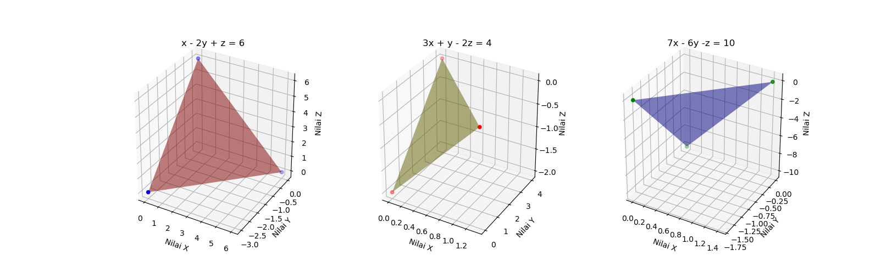

_**Catatan:**_ _Commit & push source code jawaban soal ini (beserta screenshot plot figure) ke __Github__ Anda, buatlah repo dengan nama __Ujian_SPLTV__. Kemudian lampirkan __url link repo Github__ Anda via email ke lintang@purwadhika.com!_

#

### **Soal 3 - Dosen & Mahasiswa**

1. Tuliskan langkah-langkah/urutan query MongoDB untuk membuat sebuah database Non-RDBMS (Document Store) dengan spesifikasi sebagai berikut:

    - Terdapat sebuah database dengan nama __"Kampus"__.
    - Database __"Kampus"__ memiliki 2 buah user:
        - User pertama adalah admin database bernama __"andi"__, dengan password __"anditopsecret"__. 
        - User kedua bukanlah admin, namun tetap dapat memasukkan & membaca data dari database. User kedua bernama __"budi"__, dengan password __"buditopsecret"__.
    - Database __"Kampus"__ memiliki 2 buah collection: __"Dosen"__ dan __"Mahasiswa"__.
    - Masukkan 3 buah data berikut ke collection __"Dosen"__:

        ```javascript
        {nama:"Caca",
        usia:28,
        asal:"Jakarta",
        bidang:"Fisika Astrologi",
        titel:"S2",
        status:"Honorer",
        nip:123,
        matkul:["Metrologi","Kosmologi","Kalkulus"]}

        {nama:"Dedi",
        usia:29,
        asal:"Yogyakarta",
        bidang:"Fisika Terapan",
        titel:"S3",
        status:"PNS",
        nip:456,
        matkul:["Instrumentasi","Elektronika","Fisika Dasar"]}

        {nama:"Euis",
        usia:30,
        asal:"Bandung",
        bidang:"Fisika Teoretik",
        titel:"S1",
        status:"Honorer",
        nip:789,
        matkul:["Fisika Dasar","Fisika Modern","Kalkulus"]}
        ```

    - Masukkan 3 buah data berikut ke collection __"Mahasiswa"__:

        ```javascript
        {nama:"Faza",
        usia:19,
        asal:"Aceh",
        prodi:"Fisika",
        angkatan:2017,
        nim:123}

        {nama:"Gilang",
        usia:20,
        asal:"Semarang",
        prodi:"Fisika",
        angkatan:2017,
        nim:456}

        {nama:"Hanafi",
        usia:19,
        asal:"Makassar",
        prodi:"Fisika",
        angkatan:2017,
        nim:789}
        ```

    - Ketik jawaban dari soal nomor 3.1 ini dalam file __.txt__!

2. Dengan __pyMongo__, __matplotlib__ & __pandas__, buatlah sebuah program __python__ yang dapat mengakses dan menampilkan: 
    - __Nama, asal, usia & status__ dari daftar dosen & mahasiswa di collection tersebut. Output yang diharapkan berupa __2 buah dataframe__ sebagai berikut:
        ```bash
                 asal  nama      status  usia
        0     Jakarta  Caca       dosen    28
        1  Yogyakarta  Dedi       dosen    29
        2     Bandung  Euis       dosen    30

               asal    nama      status  usia
        0      Aceh    Faza   mahasiswa    19
        1  Semarang  Gilang   mahasiswa    20
        2  Makassar  Hanafi   mahasiswa    19
        ```
    - Sekaligus menampilkan __diagram batang__ usia dari dosen & mahasiswa. Output yang diharapkan sebagai berikut:

    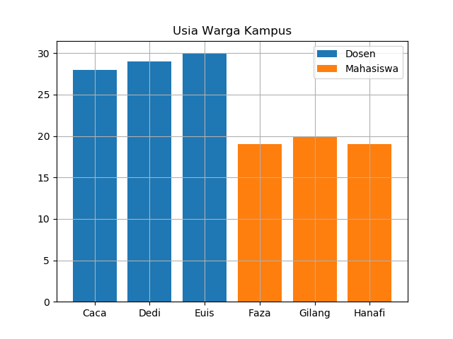

_**Catatan:**_ _Commit & push source code jawaban soal ini (beserta screenshot plot figure) ke __Github__ Anda, buatlah repo dengan nama __Ujian_DosenMahasiswa__. Kemudian lampirkan __url link repo Github__ Anda via email ke lintang@purwadhika.com!_

#

### **Soal 4 - Imunisasi**

Disediakan __4 buah dataset (.csv)__ seputar persentase balita di Indonesia yang pernah mendapatkan imunisasi __BCG, Campak, DPT & Polio__ dalam kurun tahun 1995-2017. Unduh dataset via kaggle: [unduh di sini](https://www.kaggle.com/lintangwisesa/balita-terimunisasi-di-indonesia-bps-19952017), lalu buatlah sebuah program __python__ yang dapat menampilkan data-data tersebut dalam bentuk sebagai berikut:

- Data yang _missing_ diolah dengan metode __interpolasi linear__, yakni jika terdapat nilai __'n.a'__ akan diubah menjadi __nilai antara data sebelum & sesudahnya__. 
    > _Tips:_ gunakan method ```interpolate()``` dari __pandas__).

- Usai program dieksekusi, akan muncul __2 buah figure__ sekaligus. Figure 1 berisi data __persentase balita yang pernah diimunisasi__, dan figure 2 berisi __persentase balita yang belum pernah diimunisasi__.

- Setiap figure berisi __4 buah diagram batang__ yang menunjukkan persentase balita yang pernah diimunisasi __BCG, Campak, DPT & Polio__ selama 1995-2017. Output yang diharapkan digambarkan sebagai berikut:

    > *Figure 1*: __Persentasi balita terimunisasi 1995-2017__
    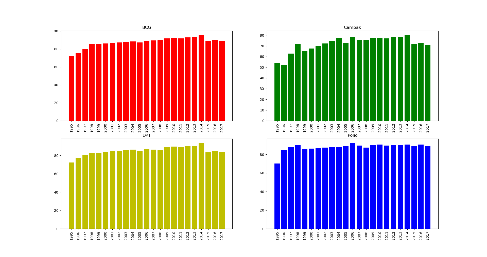

    > *Figure 2*: __Persentase balita tak terimunisasi 1995-2017__
    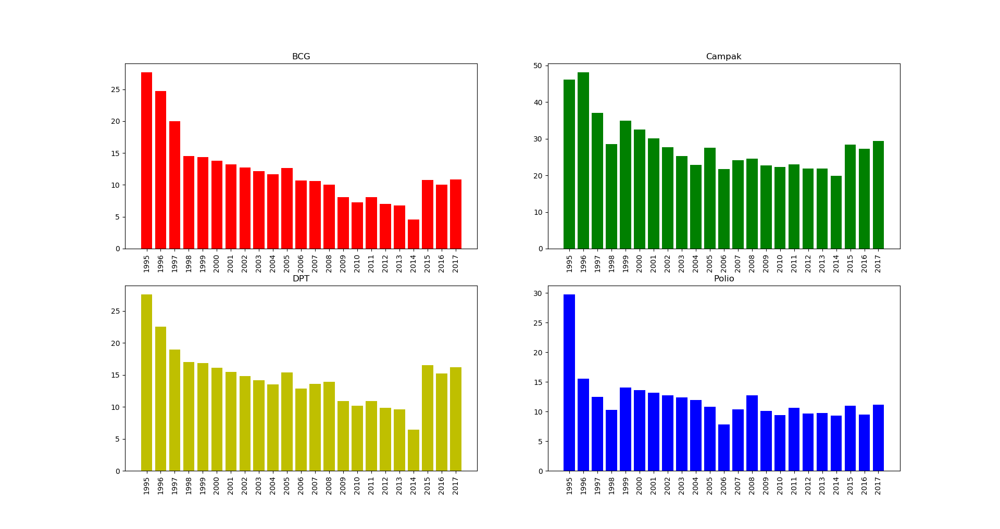

_**Catatan:**_ _Commit & push source code jawaban soal ini (beserta screenshot plot figure) ke __Github__ Anda, buatlah repo dengan nama __Ujian_Imunisasi__. Kemudian lampirkan __url link repo Github__ Anda via email ke lintang@purwadhika.com!_

#

### *__#HappyCoding__* :relaxed:

#### Lintang Wisesa :love_letter: _lintangwisesa@ymail.com_

[Facebook](https://www.facebook.com/lintangbagus) | 
[Twitter](https://twitter.com/Lintang_Wisesa) |
[Google+](https://plus.google.com/u/0/+LintangWisesa1) |
[Youtube](https://www.youtube.com/user/lintangbagus) | 
:octocat: [GitHub](https://github.com/LintangWisesa) |
[Hackster](https://www.hackster.io/lintangwisesa)
